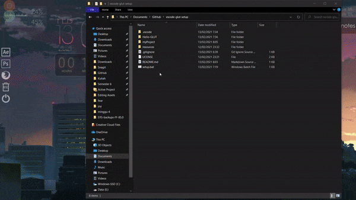

# vscode-glut-setup
VSCode Setup for OpenGL GLUT  
source: https://www.youtube.com/watch?v=NyHGek9QkvI  
credit by: Ozer  

Tinggal buka folder ini sbg workspace, buat folder project (masukin Makefilenya jg kesitu), trus jalanin build task di file yang diinginkan (default shortcut: `ctrl+shift+b`)

## Installation
1. Jalankan `setup.bat` sebagai **administrator**
2. Buka vscode di folder ini
3. Pilih file yang ingin dijalankan dan run build task (`ctrl+shift+b`)

## Notes
- Makefile hanya mengcompile 1 file. Kalo banyak file silakan sesuaikan sendiri Makefilenya pada bagian OBJS (dapat melihat contoh Makefile pada project Hello-GLUT). Silakan sesuaikan jg kalo struktur foldernya beda.
-  Apabila ingin agar tidak harus terpaku dengan workspace folder ini, masukkan setelan dalam folder .vscode ke User Settings dan User Tasks Anda.